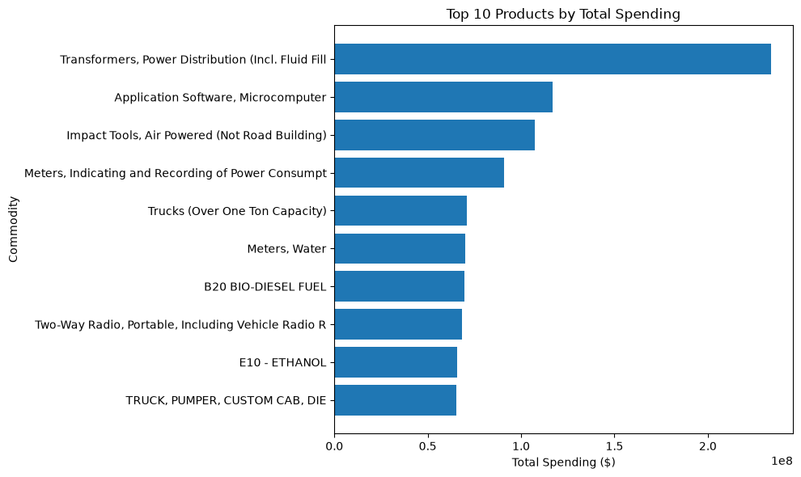
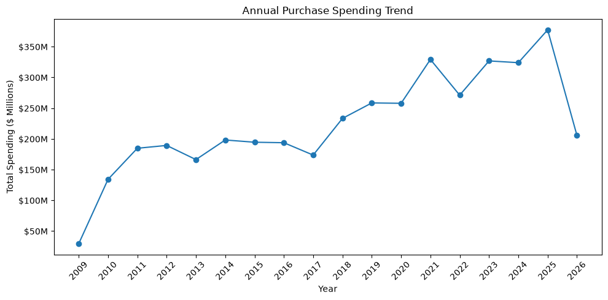
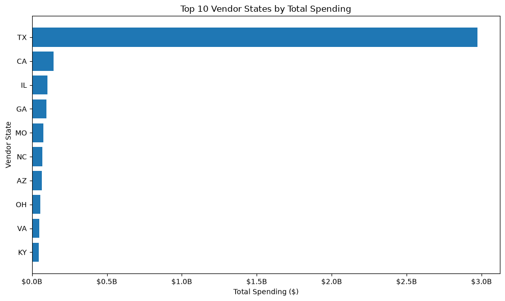
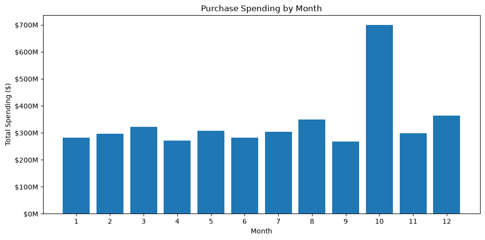
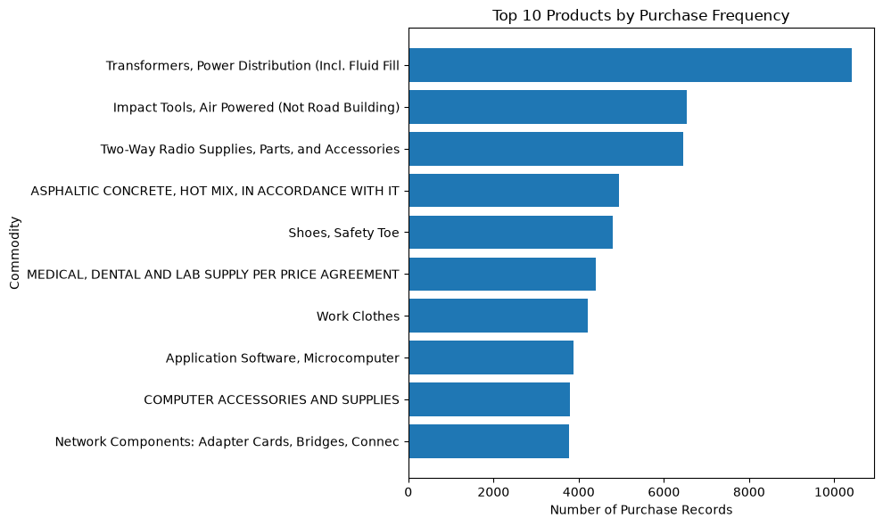

# City of Austin Purchase Order Analysis

## Project Overview

This project analyzes City of Austin purchase order data to identify purchasing patterns, spending trends, vendor concentration, commodity activity, and geographic distribution of procurement spending.

The analysis was completed using **Python, Pandas, and Matplotlib** and covers more than **320,000 purchase records** from **2009 through August 2026**.

The project demonstrates a complete data analysis workflow, including data inspection, cleaning, exploratory data analysis (EDA), visualization, and interpretation of business insights.

## Business Questions

The analysis focuses on several key questions:

- How is purchase spending distributed across transactions?
- How concentrated is spending among vendors?
- Which commodities account for the highest spending?
- Which vendors receive the highest total spending?
- How has purchasing changed over time?
- Where are major vendors geographically located?
- Are there noticeable monthly purchasing patterns?
- Which commodities appear most frequently in purchase records?

## Dataset

The dataset contains City of Austin purchase-order information including:

- Commodity and commodity description
- Quantity
- Unit price
- Item total amount
- Purchase order
- Award date
- Vendor name and vendor code
- Vendor city, state, ZIP code, and country
- Contract and master agreement information

After cleaning, the analysis contains **320,304 purchase records**.

> **Note:** The raw and cleaned CSV files are not stored in this repository because of GitHub file-size limitations. The analysis notebook documents the data preparation and cleaning process.
### Data Source

The original dataset is publicly available through the City of Austin Open Data Portal:

[Purchase Order Quantity Price detail for Commodity/Goods procurements](https://data.austintexas.gov/w/3ebq-e9iz/7r79-5ncn)

The full raw and cleaned CSV files are not included in this repository because of GitHub file-size limitations. The original data can be downloaded directly from the City of Austin Open Data Portal, and the notebook documents the cleaning and analysis workflow.

## Data Cleaning and Preparation

The dataset was inspected and prepared before analysis. Key steps included:

- Reviewing column names, data types, and dataset dimensions
- Checking missing and blank values
- Checking duplicate records
- Converting numerical fields to appropriate numeric formats
- Converting `AWARD_DATE` to datetime format
- Validating the award-date range
- Examining vendor city, state, and country fields
- Standardizing inconsistent city capitalization
- Reviewing commodity descriptions and purchase-order identifiers
- Investigating extreme values in quantity, unit price, and total purchase amount

Potential statistical outliers were retained because large values may represent legitimate procurement transactions across substantially different commodity categories.

## Exploratory Data Analysis

The descriptive analysis examined:

### Purchase Spending

Purchase-order spending was strongly right-skewed.

- **Median purchase order:** approximately **$2,010**
- **75% of purchase orders:** approximately **$7,200 or less**
- **Mean purchase order:** approximately **$24,161**

The large difference between the mean and median indicates that a relatively small number of high-value purchases substantially increase average spending.

### Vendor Concentration

Procurement spending was highly concentrated among vendors.

- **Top 1% of vendors:** 58.82% of spending
- **Top 5%:** 85.42%
- **Top 10%:** 93.21%
- **Top 25%:** 98.28%

This indicates that a relatively small share of vendors accounts for most procurement spending.

## Visual Analysis

### Top Commodities by Spending

Power distribution transformers represented the largest commodity category by total spending, at approximately **$233.9 million**.



### Annual Spending Trend

Annual procurement spending generally increased over the analysis period and reached approximately **$377.3 million in 2025**.

The 2009 and 2026 observations represent partial years and should not be interpreted as complete annual totals.



### Vendor Geography

Texas-based vendors accounted for approximately **$2.97 billion** in total spending, substantially exceeding spending associated with vendors in other states.



### Monthly Spending Pattern

October recorded substantially higher aggregate spending than other months.

This finding identifies an important purchasing pattern, although additional year-level analysis would be required to determine whether the October increase represents consistent seasonality or is influenced by unusually large transactions.



### Product Purchase Frequency

Power distribution transformers were also the most frequently recorded commodity category, appearing in **10,413 purchase records**.



## Key Insights

1. **Purchase spending is highly skewed.** Most purchase orders are relatively small, while a limited number of very large transactions substantially increase average spending.

2. **Vendor spending is highly concentrated.** The top 1% of vendors account for nearly 59% of procurement spending.

3. **Power distribution transformers are strategically important.** They rank highly in both total spending and purchase-record frequency.

4. **Procurement spending generally increased over time.** Spending reached its highest complete-year level in 2025.

5. **Vendor spending is geographically concentrated.** Texas vendors account for substantially more spending than vendors located in other states.

6. **October stands out in aggregate monthly spending.** Further analysis would be required to determine whether this represents a consistent recurring seasonal pattern.

## Tools and Skills

- **Python**
- **Pandas**
- **Matplotlib**
- **Jupyter Notebook**
- Data Cleaning
- Exploratory Data Analysis (EDA)
- Data Validation
- Data Aggregation
- Data Visualization
- Business Insight Development

## Repository Structure

```text
austin-purchase-order-analysis/
│
├── data_raw/
│   └── Raw data stored locally
│
├── data_clean/
│   └── Cleaned data stored locally
│
├── images/
│   ├── annual_spending.png
│   ├── monthly_spending.png
│   ├── product_frequency.png
│   ├── top_products.png
│   └── vendor_states.png
│
├── notebooks/
│   └── austin_purchase_order_analysis.ipynb
│
├── .gitignore
└── README.md
```

## Notebook

The complete analysis, including data preparation, exploratory analysis, calculations, and visualizations, is available in:

`notebooks/austin_purchase_order_analysis.ipynb`

## Author

**Abenezer Wondwosen**

Data Analytics Portfolio Project